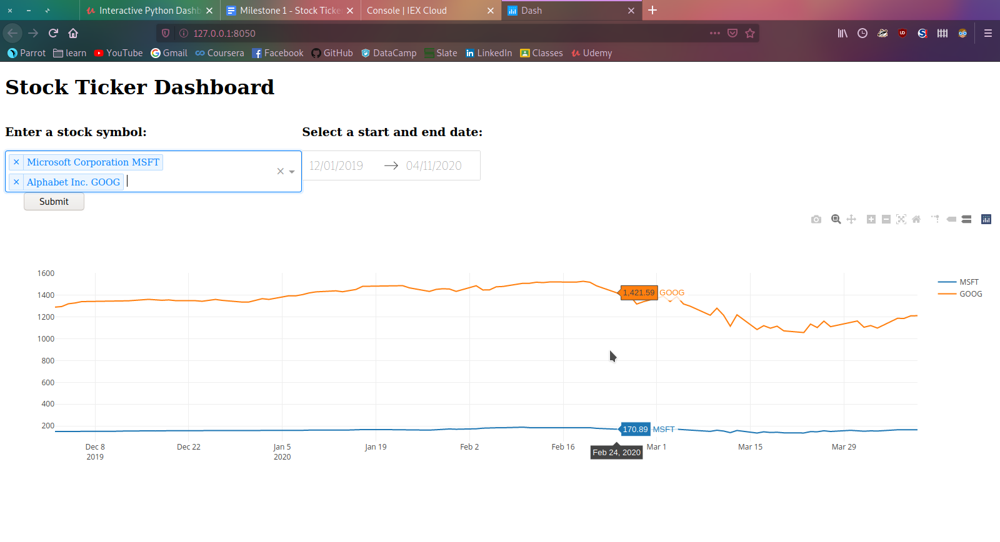

## Python Dashoard Using Dash and Plotly

This project develops a Stock Ticker Dashboard that allows the user to either enter a ticker symbol into an input box,
or to select item(s) from a dropdown list, and uses pandas_datareader to look up and display stock data on a graph.

